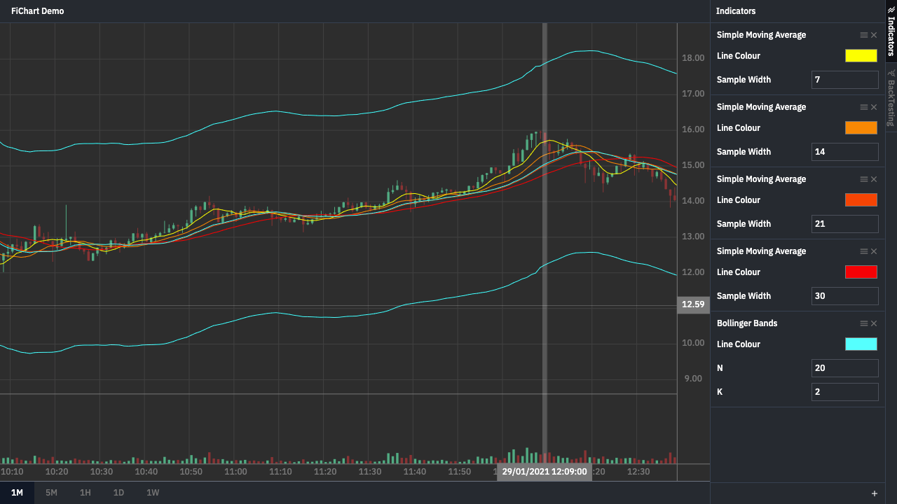

# fichart



</div>

## Usage

Prepare an array of interval data with fields below.

```tsx
export default [
    {
        "time": 1611883800,
        "open": 14.39,
        "high": 14.7,
        "low": 14.3,
        "close": 14.32,
        "volume": 761444.0
    },
    {
        "time": 1611883860,
        "open": 14.31,
        "high": 15.2,
        "low": 14.25,
        "close": 15.15,
        "volume": 19700203.0
    },
    {
        "time": 1611883920,
        "open": 15.1425,
        "high": 16.0,
        "low": 15.0,
        "close": 15.6975,
        "volume": 5757119.0
    },
    /*...*/
];
```

Then you can use the `FiChart` component with the following parameters.

```tsx
const [data, setData] = React.useState(Data);

/*...*/

<FiChart classNames={"w-full h-full"}
         data={data}
         timeScales={["1M", "5M", "1H", "1D", "1W"]}
         onTimeScaleChange={(timeScale: string) => {
             if (timeScale === "1M") {
                 setData(/*...*/);
             } else {
                 /*...*/
             }
         }}
/>
```

You can provide optional `timeScales` for custom
timescales and `onTimeScaleChange` parameters to update the data on timescale changes.
